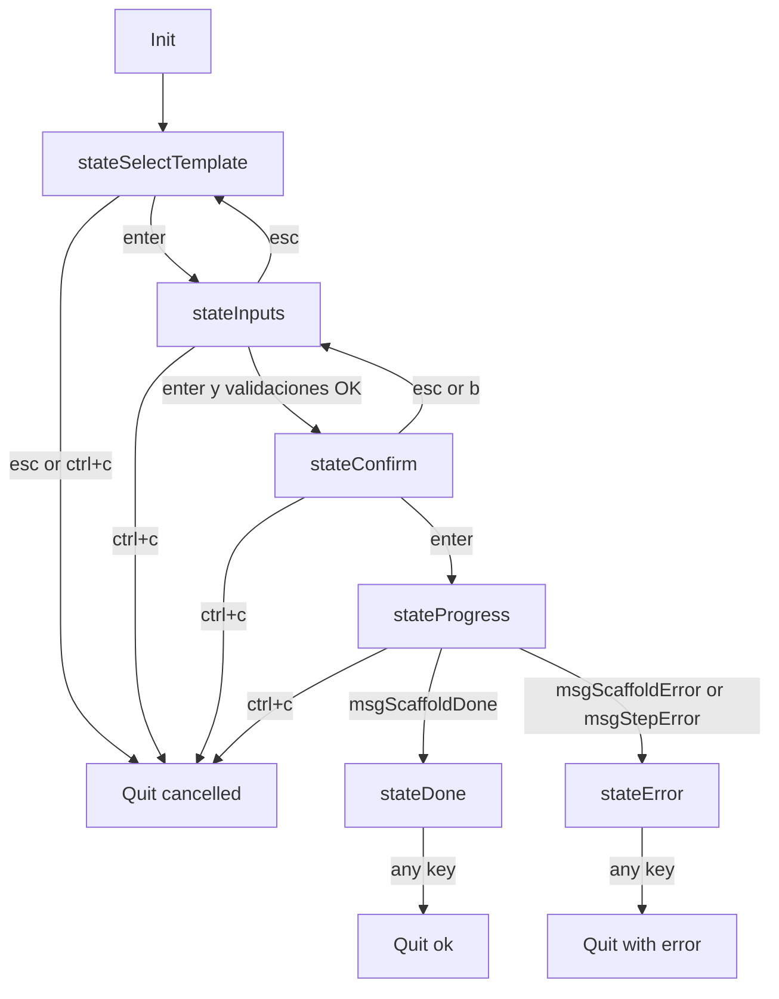

## V012-RESULTADO (rediseño TUI unificada de `structify new`)

### 1) Diagrama de estados implementado



### 2) Arquitectura del modelo

- Archivo principal: `internal/tui/app.go`.
- `type App` concentra estado global del flujo:
  - estado actual (`state`)
  - datos acumulados (`selected`, `answers`, `result`, `err`)
  - componentes UI (`selector`, `inputs`, `spinner`)
  - progreso (`progressLog`, `progressCh`)
  - dimensiones (`width`, `height`)
  - engine inyectado (`engine`).
- Entrada pública:
  - `RunApp(templates []*template.Template, eng *engine.Engine) error`
- Mensajes custom de progreso:
  - `msgFilesDone`, `msgStepStart`, `msgStepDone`, `msgStepError`, `msgScaffoldDone`, `msgScaffoldError`
  - soporte de canal con `msgProgressReady`/`msgProgressClosed`.

### 3) Flujo visual por estado (descripción)

- `stateSelectTemplate`:
  - lista filtrable de templates en la misma sesión Bubbletea.
- `stateInputs`:
  - evalúa `when:` usando la lógica compartida (`ShouldAskInput`/`BuildContext`).
  - `<= 3` inputs: formulario compacto con `tab`/`shift+tab`.
  - `> 3` inputs: avance secuencial con `enter`.
  - tipos soportados: `string` (textinput), `enum` (list), `bool` (textinput y/n).
- `stateConfirm`:
  - muestra template, output y variables acumuladas.
- `stateProgress`:
  - spinner activo y log incremental de comandos reales.
  - muestra running/done/skipped/error por step.
- `stateDone`:
  - resumen final en TUI (ruta, archivos, steps, next steps).
- `stateError`:
  - error final contextual dentro del mismo frame.

Header y barra de ayuda son persistentes en todos los estados.

### 4) Decisiones de implementación

- Progreso asíncrono:
  - `startScaffoldCmd` crea un canal `chan tea.Msg`.
  - corre `runScaffoldWithProgress` en goroutine.
  - `waitProgressMsg` consume incrementalmente del canal para evitar bloqueo del loop principal.
- Ejecución de scaffold:
  - se mantiene el contrato del engine (`engine.ProcessFiles`, `engine.ExecuteStepsWithObserver`, rollback).
  - observador (`observer`) emite mensajes Bubbletea por step.
- Terminal size:
  - `tea.WindowSizeMsg` actualiza `width/height`.
  - advertencia explícita para terminal menor a `80x24`.
  - resize de selector y listas enum.
- Enum en modelo unificado:
  - cada input enum usa `bubbles/list` embebido en `inputEntry`.
  - en confirmación se persiste el valor seleccionado dentro de `answers`.

### 5) Cobertura (`go test ./... -cover`)

Salida:

```text
ok  	github.com/jamt29/structify	0.025s	coverage: 0.0% of statements
ok  	github.com/jamt29/structify/cmd	0.048s	coverage: 69.3% of statements
ok  	github.com/jamt29/structify/cmd/structify	0.024s	coverage: 100.0% of statements
ok  	github.com/jamt29/structify/cmd/template	0.040s	coverage: 62.3% of statements
ok  	github.com/jamt29/structify/internal/config	(cached)	coverage: 81.8% of statements
ok  	github.com/jamt29/structify/internal/dsl	(cached)	coverage: 87.7% of statements
ok  	github.com/jamt29/structify/internal/engine	(cached)	coverage: 74.1% of statements
ok  	github.com/jamt29/structify/internal/template	(cached)	coverage: 73.7% of statements
ok  	github.com/jamt29/structify/internal/tui	0.024s	coverage: 34.0% of statements
ok  	github.com/jamt29/structify/templates	(cached)	coverage: 100.0% of statements
```

### 6) Estado final

- `go build ./...`: OK
- `go test ./...`: OK
- `go test ./... -cover`: OK
- `go run . new --template clean-architecture-go --name my-api --dry-run`: OK (flujo flags intacto)
- `go run . new` en este entorno sin TTY: retorna `no TTY detected: --template is required` (esperado para shell no interactiva).

### 7) Lecciones capturadas

- Para progreso en tiempo real dentro de Bubbletea, un único `tea.Cmd` bloqueante no alcanza; se necesita canal + comando lector incremental para ver steps mientras corren.
- Mantener el loop en `tea.WithAltScreen()` durante todo el flujo elimina el salto entre pantallas (selector/inputs/confirm/progress/done en un solo modelo).
- Reusar `BuildContext`/`ValidateInputValue` evita divergencias de reglas de `when/default/validate` entre UI y lógica de negocio.
